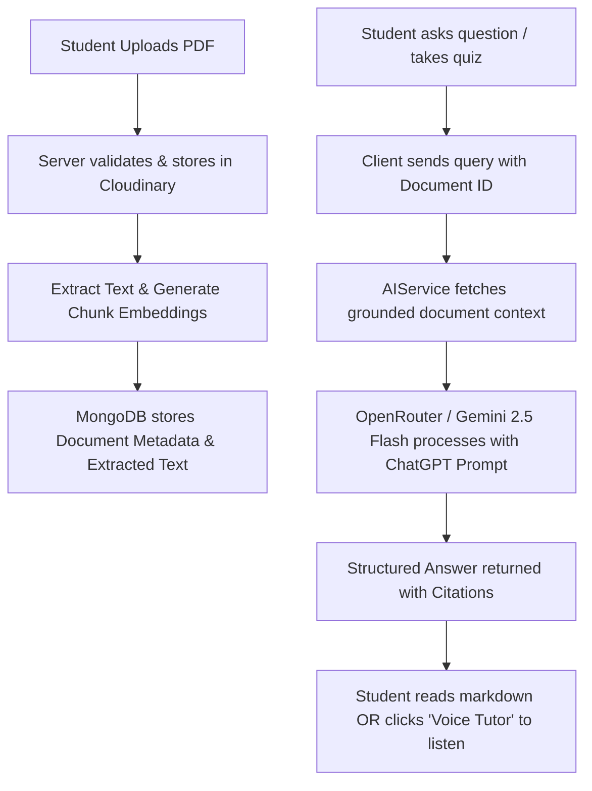

# 🧠 EduMind AI — Next-Gen AI Study Companion

<p align="center">
  
  
  
  
  
</p>

---

## 📖 About EduMind AI (Project Overview)

**EduMind AI** is an intelligent, full-stack learning and revision platform designed for students, researchers, and self-learners. It transforms static study materials (PDFs, textbooks, lecture slides) into an interactive, grounded learning ecosystem.

Traditional study tools either require manual summarization or produce generic, unverified AI answers. EduMind AI bridges this gap with **Zero-Hallucination Document Grounding (RAG)**, structured ChatGPT-style explanations, interactive voice tutoring with cute tone synthesis, real-time analytics, automated quizzes, flashcards, mind maps, and a community review system.

---

## ✨ Key Features & Capabilities

### 1. 🤖 ChatGPT-Structured AI Answers
- **Direct & Structured Answers**: Formatted with clear headings (`###`), bullet points (`•`), bold definitions, and concrete code/examples.
- **💡 Key Takeaway**: Every explanation ends with a concise revision summary.
- **Bilingual (English & Hindi/Hinglish)**: Ask questions in English, Hindi, or Hinglish, and get articulate, friendly explanations in the same language.
- **Strict Grounding**: Answers are referenced directly against your uploaded documents with verifiable citations.

### 2. 🎙️ Interactive Voice Tutor
- Integrated **Speech Synthesis Engine** with natural conversational voice (`Microsoft Jenny`, `Microsoft Zira`, `Google English Female`, etc.).
- **Smart Text Filtering**: Code blocks, markdown symbols, and raw emojis are automatically stripped during speech generation so the audio sounds fluid and human.
- Available directly on every chat message bubble and in the dedicated **Interactive Voice Tutor Modal**.

### 3. 📄 Smart Document Management & Uploads
- **Accurate File Sizing**: Real-time MB/KB computation for uploads (no `0.00 MB` display bugs).
- **Secure Cloud Storage**: Cloudinary integration for cloud-hosted PDFs with encrypted storage.
- **Drag & Drop Upload Zone**: Seamless drag-and-drop with live preview, upload stage indicators, and vectorization status.

### 4. 📊 Real-Time Analytics & Quiz Tracking
- Track total quizzes taken, accuracy percentage, average score, and study consistency.
- Real-time updates: whenever a quiz is completed, metrics refresh instantly across the Dashboard and Analytics pages.

### 5. 🗂️ Automated Flashcards & Quizzes
- Generate multiple-choice quizzes with explanations and difficulty tagging directly from study chapters.
- Dynamic flashcard decks for active recall and spaced repetition.

### 6. 🗺️ Mind Maps & Study Planner
- Interactive visual mind maps for complex concept hierarchies.
- AI-generated customizable study timetables (weekly, monthly, or 1-day cram sessions).

### 7. ⭐ Community Feedback & Review System
- Integrated feedback modal with 1-to-5 star ratings, category filters, quick highlight tags, and user testimonials.
- Fully mobile-responsive design with touch-friendly controls.

---

## 🛠️ Tech Stack & Architecture

### **Frontend (Client)**
| Technology | Purpose |
| :--- | :--- |
| **React 18 + Vite** | High-performance SPA framework |
| **TypeScript** | Type-safe code and interfaces |
| **Tailwind CSS** | Clean, modern, mobile-first design system |
| **Lucide React** | Sleek icon library |
| **Zustand** | Lightweight client state management (Auth, Sessions) |
| **Axios** | HTTP client with automatic JWT refresh interceptors |
| **React Markdown & Remark GFM** | Rich markdown rendering with tables and code blocks |
| **Web Speech API** | Client-side Voice Recognition & Voice Tutor Speech Synthesis |

### **Backend (Server)**
| Technology | Purpose |
| :--- | :--- |
| **Node.js & Express.js** | REST API service layer |
| **TypeScript** | End-to-end type safety |
| **MongoDB & Mongoose** | NoSQL database for users, documents, quizzes, and feedback |
| **JWT (JSON Web Tokens)** | Secure access & refresh token authentication |
| **Multer & Cloudinary** | Memory storage and secure cloud PDF processing (up to 25MB) |
| **OpenRouter API** | Multi-model fallback LLM routing (`Google Gemini 2.5 Flash`, `Gemini 2.5 Flash Lite`, `DeepSeek V4`, etc.) |

---

## 🏗️ How It Works (Workflow)



1. **Upload & Ingestion**: When a PDF is uploaded, it is stored in Cloudinary, text content is extracted and indexed with chunk-level metadata.
2. **Context Retrieval**: When you query the AI, the backend retrieves relevant document context from MongoDB.
3. **Structured Generation**: The query and document context are passed to the LLM with a specialized system prompt enforcing clean ChatGPT formatting, bold terms, bullet points, and key takeaways.
4. **Cute Audio Synthesis**: Clicking the voice button runs the browser's speech synthesis engine tuned to a warm, friendly frequency with stripped markdown tags.
5. **Real-Time Tracking**: Quiz attempts, bookmarks, and activity logs are saved instantly to MongoDB and reflected across user analytics.

---

## 📂 Project Structure

```bash
EduMind-AI/
├── client/                     # Frontend React Vite Application
│   ├── src/
│   │   ├── api/                # API client functions (chat, document, quiz, feedback, etc.)
│   │   ├── components/         # UI Components
│   │   │   ├── dashboard/      # ChatBox, UploadCard, DocumentList, Topbar, Sidebar
│   │   │   ├── feedback/       # FeedbackModal (reviews & star ratings)
│   │   │   └── pdf/            # SummaryCard, PDF viewer
│   │   ├── layouts/            # DashboardLayout (mobile-responsive layout)
│   │   ├── pages/              # Dashboard, Documents, Analytics, Planner, Landing
│   │   ├── store/              # Zustand Auth Store
│   │   └── utils/              # cuteSpeech.ts, formatters.ts, cn.ts
│   └── package.json
│
├── server/                     # Backend Node.js Express Application
│   ├── src/
│   │   ├── controllers/        # Request handlers (auth, document, quiz, feedback)
│   │   ├── middlewares/        # Auth protect, upload multer, error handlers
│   │   ├── models/             # Mongoose schemas (User, Document, Quiz, Feedback, Bookmark)
│   │   ├── routes/             # Express API routes
│   │   ├── services/           # ai.service.ts, cloudinary.service.ts
│   │   ├── utils/              # Logger, token helpers
│   │   └── server.ts           # Server entry point
│   └── package.json
│
└── README.md                   # Project Documentation
```

---

## ⚙️ Installation & Setup (Local Development)

### 1. Prerequisites
- **Node.js**: v18.x or higher
- **npm**: v9.x or higher
- **MongoDB**: Local MongoDB instance or MongoDB Atlas URI
- **Cloudinary Account**: Cloud name, API Key, API Secret
- **OpenRouter API Key**: For Gemini 2.5 Flash / LLM generation

---

### 2. Clone the Repository
```bash
git clone https://github.com/Devender38/EduMind-AI.git
cd EduMind-AI
```

---

### 3. Setup the Backend (`server`)

1. Navigate to the server folder and install dependencies:
   ```bash
   cd server
   npm install
   ```

2. Create a `.env` file inside `server/`:
   ```env
   PORT=5000
   NODE_ENV=development
   MONGO_URI=your_mongodb_connection_string

   JWT_SECRET=your_jwt_secret
   JWT_REFRESH_SECRET=your_jwt_refresh_secret
   JWT_ACCESS_EXPIRE=15m
   JWT_REFRESH_EXPIRE=7d

   CLOUDINARY_CLOUD_NAME=your_cloud_name
   CLOUDINARY_API_KEY=your_cloudinary_api_key
   CLOUDINARY_API_SECRET=your_cloudinary_api_secret

   OPENROUTER_API_KEY=your_openrouter_api_key
   MODEL_NAME=google/gemini-2.5-flash
   ```

3. Start the backend development server:
   ```bash
   npm run dev
   ```
   *The backend will start at `http://localhost:5000`.*

---

### 4. Setup the Frontend (`client`)

1. Open a new terminal, navigate to the `client` folder and install dependencies:
   ```bash
   cd client
   npm install
   ```

2. Create a `.env` file inside `client/`:
   ```env
   VITE_API_URL=http://localhost:5000/api
   ```

3. Start the client dev server:
   ```bash
   npm run dev
   ```
   *The frontend will run at `http://localhost:5173`.*

---

## 🔒 API Endpoints Overview

| Method | Endpoint | Description | Protected |
| :--- | :--- | :--- | :--- |
| **POST** | `/api/auth/register` | Register new student account | No |
| **POST** | `/api/auth/login` | Login and obtain JWT tokens | No |
| **POST** | `/api/documents/upload` | Upload & vectorize PDF document (up to 25MB) | Yes |
| **GET** | `/api/documents` | List uploaded user documents | Yes |
| **DELETE** | `/api/documents/:id` | Delete document and associated vectors | Yes |
| **POST** | `/api/chat` | Ask grounded AI question (ChatGPT structured) | Yes |
| **POST** | `/api/quiz/generate` | Generate chapter quiz | Yes |
| **POST** | `/api/quiz/submit` | Submit quiz answers and track live score | Yes |
| **GET** | `/api/history/stats` | Fetch live analytics and study performance | Yes |
| **POST** | `/api/feedback` | Submit star rating and website review | Yes |
| **GET** | `/api/feedback` | Get public community reviews | No |

---

## 📱 Mobile Responsiveness

The application is completely mobile-responsive:
- **Collapsible Sidebar**: Full off-canvas drawer on phones with touch backdrop.
- **Adaptive Topbar**: Compact buttons with mobile-safe padding to prevent overflow.
- **Scrollable Modals**: Voice Tutor and Feedback dialogs feature fixed sticky headers and scrollable bodies (`max-h-[92vh]`) to ensure no buttons or headings are cut off on small screens.

---

## 🤝 Contributing

Contributions, issues, and feature suggestions are always welcome!
1. Fork the Project
2. Create your Feature Branch (`git checkout -b feature/AmazingFeature`)
3. Commit your Changes (`git commit -m 'Add some AmazingFeature'`)
4. Push to the Branch (`git push origin feature/AmazingFeature`)
5. Open a Pull Request

---

## 📜 License

Distributed under the **MIT License**. See `LICENSE` for more information.

<p align="center">
  Crafted with ❤️ for students worldwide by <b>Devender</b>
</p>
